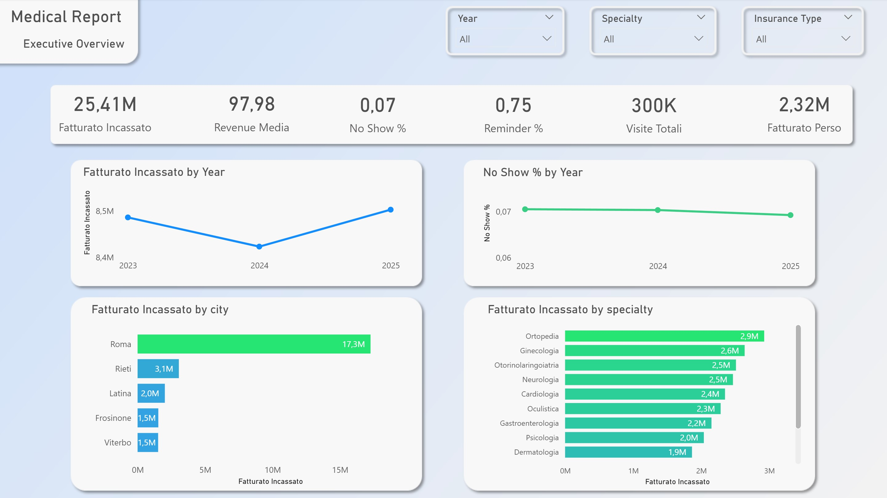

# Medical Platform Report — Simulazione Analytics Sanitaria (Regione Lazio)
di Fabrizio Fagetti - Data Analyst

Progetto end-to-end di Data Analysis su una piattaforma simulata di servizi medici nella Regione Lazio: generazione dati sintetici → modellazione relazionale → database MySQL → analisi SQL → dashboard Power BI.


*Dashboard Power BI — Executive Overview*

---

## Indice

- [Panoramica](#panoramica)
- [Obiettivo del progetto](#obiettivo-del-progetto)
- [Perimetro del dataset](#perimetro-del-dataset)
- [Metodologia](#metodologia)
- [Struttura del repository](#struttura-del-repository)
- [Tech stack](#tech-stack)
- [Come eseguire il progetto](#come-eseguire-il-progetto)
- [Dashboard Power BI](#dashboard-power-bi)
- [Insight principali](#insight-principali)
- [Executive Summary](#executive-summary)
- [Video di presentazione](#video-di-presentazione)
- [Limitazioni note](#limitazioni-note)
- [Roadmap](#roadmap)
- [Autore](#autore)
- [Licenza](#licenza)

---

## Panoramica

Il progetto simula una piattaforma regionale di servizi medici operante nel Lazio, con l'obiettivo di replicare un flusso di lavoro realistico di data analysis in ambito sanitario: dalla generazione dei dati fino alla comunicazione degli insight tramite dashboard interattive.

I dati **non descrivono una realtà esistente**: sono generati sinteticamente ma progettati per mantenere coerenza interna tra pazienti, provider, strutture, appuntamenti, diagnosi, farmaci, fatturazione, esami di laboratorio e feedback.

## Obiettivo del progetto

L'analisi è stata costruita per rispondere a quattro domande di business:

| Area | Domanda analitica |
|---|---|
| Executive Overview | Qual è lo stato complessivo del business? |
| No-Show Analysis | Dove e come si concentrano le mancate presentazioni? |
| Business & Revenue Insights | Quali specialità e territori generano più valore? |
| Patient Analysis | Quali segmenti hanno maggiore valore e rischio? |

## Perimetro del dataset

| Tabella | Record |
|---|---|
| patients | 50.000 |
| clinics | 50 |
| providers | 400 |
| appointments | 300.000 |
| diagnoses | 259.368 |
| medications | 90.922 |
| billing | 259.368 |
| lab_results | 64.753 |
| feedback | 46.751 |

Periodo coperto: **2023-01-01 → 2025-12-31** (3 anni).

Dettaglio completo di ogni colonna, tipo e vincolo in [`data_dictionary.md`](data_dictionary.md).

## Metodologia

- Dati generati con **Python** (`numpy`/`pandas`), seed fisso (`np.random.seed(42)`) per riproducibilità.
- Prevalenze cliniche (ipertensione, diabete, asma/BPCO, cardiopatia ischemica, obesità) modellate come funzione crescente dell'età, non uniformi.
- Comportamento no-show modellato con propensione individuale per paziente, corretta per lead time, età, tipo di appuntamento (telemedicina vs presenza) e invio reminder.
- Diagnosi codificate con **ICD-10** reale, farmaci con **ATC** reale — assegnati però in modo sintetico/casuale (non rappresentano percorsi clinici reali). Vedi nota metodologica in `data_dictionary.md`.
- Struttura relazionale caricata in **MySQL**, validata con query di data quality, poi analizzata via SQL e visualizzata in **Power BI**.

## Struttura del repository

```
Medical-Platform-Report/
├── README.md
├── data_dictionary.md
├── requirements.txt
├── .gitignore
├── .env.example
├── python/
│   └── generate_sim_med_lazio.py
├── sql/
│   ├── 01_schema_creation.sql
│   ├── 02_data_quality_validation.sql
│   ├── 03_kpi_generali.sql
│   ├── 04_analisi_temporale_demografica.sql
│   ├── 05_analisi_economica_clinica.sql
│   ├── 06_segmentazione_pazienti.sql
│   ├── 07_analisi_no_show.sql
│   └── 08_viste_powerbi.sql
├── data/
│   └── csv/
│       ├── patients.csv
│       ├── providers.csv
│       ├── clinics.csv
│       ├── appointments.csv
│       ├── diagnoses.csv
│       ├── medications.csv
│       ├── lab_results.csv
│       ├── billing.csv
│       └── feedback.csv
├── powerbi/
│   └── Medical_Platform_Report.pbix
└── docs/
    ├── Medical_Platform_Executive_Analysis.pdf
    └── assets/
        └── dashboard_preview.jpg
```

> Nota: questa è la struttura proposta per coerenza con il progetto di riferimento — adattala liberamente se i tuoi file locali sono organizzati diversamente.

## Tech stack

- **Python** (pandas, numpy) — generazione dataset sintetico
- **MySQL** — modellazione relazionale e storage
- **SQL** — estrazione KPI, validazione qualità dati, viste per Power BI
- **Power BI** — dashboard interattive

> Lo script include anche import di `matplotlib` e `scikit-learn`, predisposti per una futura estensione di *predictive analytics* (vedi [Roadmap](#roadmap)) — non utilizzati nella versione attuale del progetto.

## Come eseguire il progetto

1. Clona il repository e crea un ambiente virtuale:
   ```powershell
   git clone https://github.com/Fabriscious/Medical-Platform-Report.git
   cd Medical-Platform-Report
   python -m venv venv
   venv\Scripts\activate
   pip install -r requirements.txt
   ```
2. Copia `.env.example` in `.env` e inserisci le tue credenziali MySQL locali (il file `.env` non va mai committato).
3. (Opzionale) Rigenera i dati sintetici:
   ```powershell
   python python/generate_sim_med_lazio.py
   ```
4. Crea lo schema del database:
   ```sql
   -- eseguire sql/01_schema_creation.sql su MySQL
   ```
5. Importa i CSV nelle rispettive tabelle (es. via MySQL Workbench "Table Data Import Wizard" o `LOAD DATA INFILE`).
6. Esegui `sql/02_data_quality_validation.sql` per verificare l'integrità dei dati.
7. Esegui le query di analisi (`03`–`08`) ed apri `powerbi/Medical_Platform_Report.pbix`, aggiornando la connessione dati al tuo database locale.

## Dashboard Power BI

| Dashboard | Contenuto |
|---|---|
| **Executive Overview** | Fatturato incassato, appuntamenti totali, no-show rate, reminder coverage, andamento triennale |
| **No-Show Analysis** | Segmentazione no-show per età, reminder, specialità, giorno della settimana |
| **Business & Revenue Insights** | Fatturato per specialità, concentrazione geografica, prezzo medio per tipo di copertura |
| **Patient Analysis** | Segmentazione pazienti per frequenza visite, top patients ad alto valore/rischio |

## Insight principali

- Fatturato incassato: **€25,41 M** su 3 anni, business stabile (~€9,4 M/anno)
- No-show rate: **7%** — principale area di inefficienza
- Reminder coverage: **75%**; con reminder il no-show scende dal 10,12% al 5,96% (riduzione relativa ~41%)
- Concentrazione geografica: **Roma genera ~€17,3 M** (67% del fatturato totale)
- Segmento High Frequency: solo 2% dei pazienti ma **~€1 M** di fatturato

Analisi completa nell'[Executive Summary](#executive-summary).

## Executive Summary

Il report di sintesi manageriale è disponibile in [`docs/Medical_Platform_Executive_Analysis.pdf`](docs/Medical_Platform_Executive_Analysis.pdf).

## Video di presentazione

📺 [Guarda il video su YouTube](#) — <youtu.be/TkfvKTz7-CI>

## Limitazioni note

- I CAP (postcode) sono generati come numeri casuali in un range fisso e **non rispecchiano i prefissi CAP reali** delle province laziali — limitazione nota della generazione sintetica, irrilevante ai fini analitici del progetto ma segnalata per trasparenza.
- I codici ICD-10 e ATC sono standard reali, ma la loro **assegnazione ai pazienti è sintetica/casuale** e non riflette percorsi clinici realistici (vedi `data_dictionary.md`).
- Il confronto no-show con/senza reminder è **osservazionale**, non uno studio controllato: l'evidenza è associativa, non causale.

## Roadmap

- [ ] Modello supervisionato di probabilità di no-show (scikit-learn), validato su split temporale
- [ ] KPI *Expected Lost Revenue* = probabilità di no-show × valore della prestazione
- [ ] Integrazione dello scoring predittivo in Power BI per targeting dei reminder
- [ ] Aggiunta di costi provider/struttura per analisi di marginalità

## Autore

**Fabrizio Fagetti** — Data Analyst
<linkedin.com/in/fabrizio-fagetti-7b5773154>
<github.com/Fabriscious>


## Licenza

Questo progetto è distribuito sotto licenza [MIT](LICENSE).
